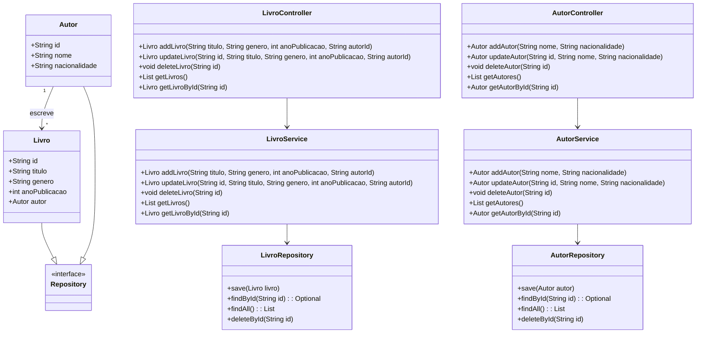

# Catalogo de Filmes

## Descrição
Uma API GraphQL para gerenciar um catálogo de livros, desenvolvida com Spring Boot, MongoDB e GraphQL.

## Tecnologias
- Java 17
- Spring framework
- MongoDB
- GraphQL
- Lombok
- GraphiQL
- docker
- maven

## Diagrama de Classes (Domínio da API)


## Testes
Se ainda não subiu o MongoDB, rode:
```bash
docker-compose up -d
```
Para conferir se o container está rodando:
```bash
docker ps
```
Agora, basta rodar:
```bash
mvn spring-boot:run
```
Agora para testar a aplicação acesse: 
```bash
http://localhost:8080/graphiql
```


## Contribuição

Contribuições são bem-vindas! Siga os passos abaixo:

1. Fork o repositório.
2. Crie uma nova branch (git checkout -b feature/nova-feature).
3. Commit suas alterações (git commit -m 'Adiciona nova feature').
4. Push para a branch (git push origin feature/nova-feature).
5. Abra um Pull Request.
